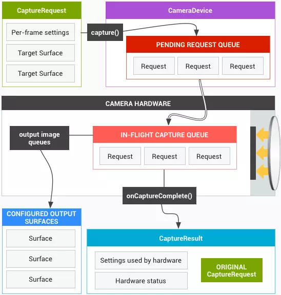

一.概述
    1.Android5.0(API.21)之后,Google 引入了一套全新的相机框架(android.hardware.camera2),同时废弃了旧的相机框架(android.hardware.Camera)
    2.Pipeline(管道模型),camera2的 API 模型被设计成一个 Pipeline,按顺序处理每一帧的请求并返回请求结果给客户端
    <!--  -->
    
    3.Supported Hardware Level(支持的硬件等级):从低到高一共有 LEGACY、LIMITED、FULL、LEVEL_3 四个级别;
    
        3.1>LEGACY：向后兼容的级别，处于该级别的设备意味着它只支持 Camera1 的功能，不具备任何 camera2 高级特性
        3.2>LIMITED：除了支持 Camera1 的基础功能之外，还支持部分 camera2 高级特性的级别
        3.3>FULL：支持所有 Camera2 的高级特性
        3.4>LEVEL_3：新增更多 Camera2 高级特性，例如 YUV 数据的后处理(像素数据的后处理)等
    4.Capture(图像捕获):执行方式分为【单次模式】、【多次模式】、【重复模式】三种
        4.1>单次模式（One-shot）：指的是只执行一次的 Capture 操作，例如设置闪光灯模式、对焦模式和拍一张照片等。多个一次性模式的 Capture 会进入队列按顺序执行
        4.2>多次模式（Burst）：指的是连续多次执行指定的 Capture 操作，该模式和多次执行单次模式的最大区别是连续多次 Capture 期间不允许插入其他任何 Capture 操作
        4.3>重复模式（Repeating）：指的是不断重复执行指定的 Capture 操作，当有其他模式的 Capture 提交时会暂停该模式，转而执行其他被模式的 Capture，当其他模式的
        Capture 执行完毕后又会自动恢复继续执行该模式的 Capture --- (新提交的模式会覆盖旧的模式)
    5.CameraManager 是负责查询和建立相机连接的系统服务,关键功能有：
        5.1>将相机信息封装到 CameraCharacteristics 中，并提获取 CameraCharacteristics 实例的方式
        5.2>根据指定的相机 ID 连接相机设备
        5.3>提供将闪光灯设置成手电筒模式的快捷方式
    6.CameraCharacteristics 是只读的相机信息提供者，其内部携带大量的相机信息，包括代表相机朝向的 LENS_FACING；判断闪光灯是否可用的 FLASH_INFO_AVAILABLE；
      获取所有可用 AE 模式的 CONTROL_AE_AVAILABLE_MODES 等  
    7.CameraDevice CameraDevice 代表当前连接的相机设备，它的职责有四个:
        7.1>根据指定的参数创建 CameraCaptureSession
        7.2>根据指定的模板创建 CaptureRequest
        7.3>关闭相机设备
        7.4>监听相机设备的状态，例如断开连接、开启成功和开启失败等
    8.Surface 是一块用于填充图像数据的内存空间，例如你可以使用 SurfaceView 的 Surface 接收每一帧预览数据用于显示预览画面，也可以使用 ImageReader 的 Surface 接收 
      JPEG 或 YUV 数据;每一个 Surface 都可以有自己的尺寸和数据格式，你可以从 CameraCharacteristics 获取某一个数据格式支持的尺寸列表
    9.CameraCaptureSession 实际上就是配置了目标 Surface 的 Pipeline 实例，我们在使用相机功能之前必须先创建 CameraCaptureSession 实例;一个 CameraDevice 一次只能开启一个 
      CameraCaptureSession，绝大部分的相机操作都是通过向 CameraCaptureSession 提交一个 Capture 请求实现的，例如拍照、连拍、设置闪光灯模式、触摸对焦、显示预览画面等
    10.CaptureRequest CaptureResult 是每一次 Capture 操作的结果，里面包括了很多状态信息，包括闪光灯状态、对焦状态、时间戳等;例如你可以在拍照完成的时候，通过 
       CaptureResult 获取本次拍照时的对焦状态和时间戳。需要注意的是，CaptureResult 并不包含任何图像数据，前面我们在介绍 Surface 的时候说了，图像数据都是从 Surface 获取的
    11.仅有 camera2 支持的高级特性:
        11.1>在开启相机之前检查相机信息:  出于某些原因，你可能需要先检查相机信息再决定是否开启相机，例如检查闪光灯是否可用;在
            Caemra1 上，你无法在开机相机之前检查详细的相机信息，因为这些信息都是通过一个已经开启的相机实例提供的;在 
            camera2 上，我们有了和相机实例完全剥离的CameraCharacteristics 实例专门提供相机信息，所以我们可以在不开启相机的前提下检查几乎所有的相机信息
        11.2>在不开启预览的情况下拍照:  在 
            Camera1 上，开启预览是一个很重要的环节，因为只有在开启预览之后才能进行拍照，因此即使显示预览画面与实际业务需求相违背的时候，你也不得不开启预览。而 
            camera2 则不强制要求你必须先开启预览才能拍照
        11.3>一次拍摄多张不同格式和尺寸的图片:  在 Camera1 上，一次只能拍摄一张图片，更不同谈多张不同格式和尺寸的图片了。而 
            camera2 则支持一次拍摄多张图片，甚至是多张格式和尺寸都不同的图片。例如你可以同时拍摄一张 1440x1080 的 JPEG 图片和一张全尺寸的 RAW 图片
        11,4>控制曝光时间:  在暗环境下拍照的时候，如果能够适当延长曝光时间，就可以让图像画面的亮度得到提高。在 
            camera2 上，你可以在规定的曝光时长范围内配置拍照的曝光时间，从而实现拍摄长曝光图片，你甚至可以延长每一帧预览画面的曝光时间让整个预览画面在暗环境下也能保证一定的亮度  
        11.5>连拍:  camera2，可以让相机应用程序支持连拍功能，甚至是连续拍 30 张使用不同曝光时间的图片    
        11.6>灵活的 3A 控制:  3A（AF、AE、AWB）的控制在 camera2 上得到了最大化的放权，应用层可以根据业务需求灵活配置 3A 流程并且实时获取 3A 状态;例如你可以在拍照前进行 
            AE 操作，并且监听本这次拍照是否点亮闪光灯      

